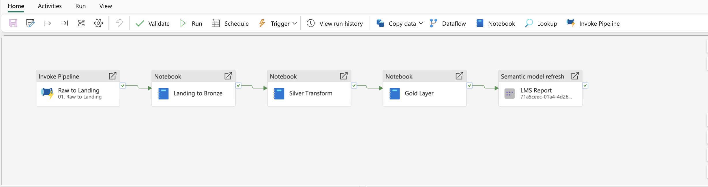
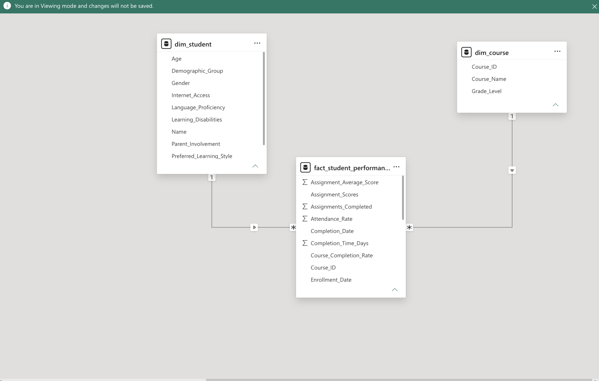
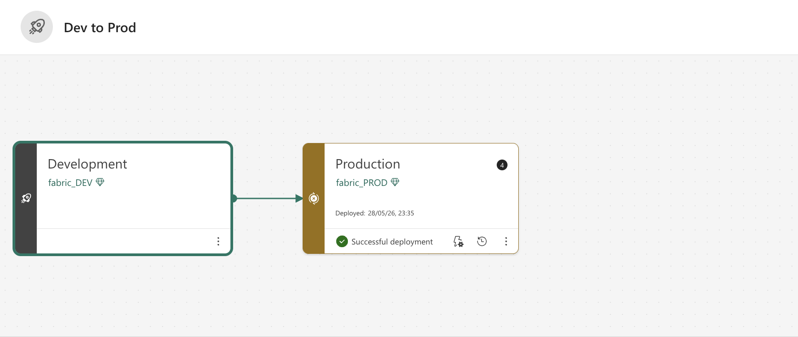
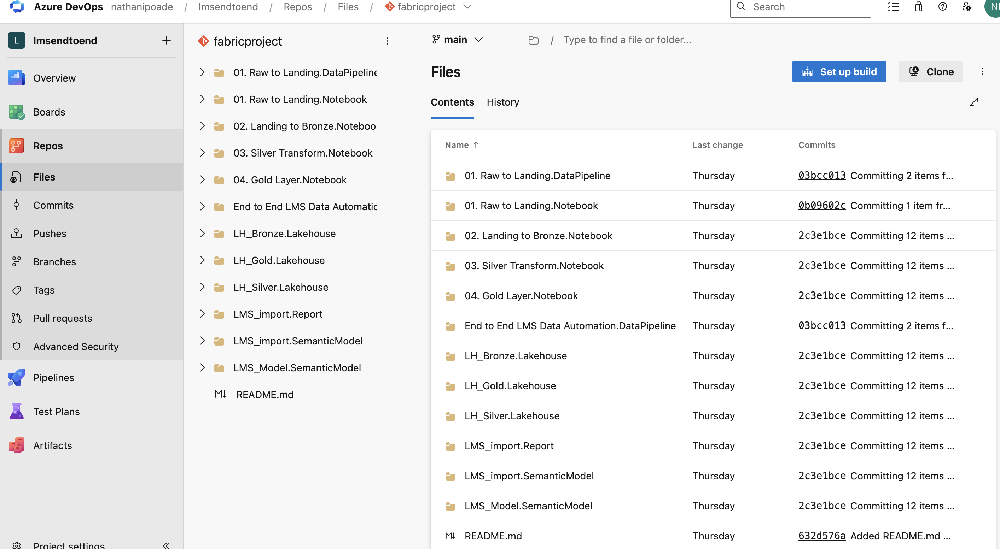

# End-to-End LMS Analytics Platform using Microsoft Fabric

## Project Overview

This project is an end-to-end Learning Management System (LMS) analytics platform built using Microsoft Fabric, Azure Data Lake Storage Gen2, PySpark, Spark SQL, Delta Lake, Power BI, Azure DevOps, and Fabric Deployment Pipelines.

The goal was to simulate a real-world analytics engineering workflow where data is ingested daily, processed incrementally, transformed through Bronze, Silver, and Gold Lakehouse layers, modeled into a star schema, and published through a governed semantic model and Power BI report.

---

## Business Problem

Learning platforms generate large volumes of student, course, engagement, and performance data. Without a structured analytics pipeline, organizations may struggle to track student progress, course completion, learning patterns, and performance trends accurately.

This project solves that problem by building a scalable analytics platform that automates data movement from raw storage to business-ready reporting.

---

## Architecture

### Architecture Flow

ADLS Gen2 Raw Zone → Landing Zone → Bronze Lakehouse → Silver Lakehouse → Gold Lakehouse → Semantic Model → Power BI Report → Production Deployment

---

## Technology Stack

- Microsoft Fabric
- Azure Data Lake Storage Gen2
- PySpark
- Spark SQL
- Delta Lake
- Microsoft Fabric Lakehouse
- Power BI
- Semantic Model
- Azure DevOps
- Fabric Deployment Pipelines

---

## Pipeline Design

The pipeline moves LMS data through the full Medallion Architecture:

1. Raw to Landing
2. Landing to Bronze
3. Bronze to Silver
4. Silver to Gold
5. Semantic Model Refresh

---

## Data Engineering Workflow

### Bronze Layer

The Bronze layer stores raw ingested LMS records in Delta format.

### Silver Layer

The Silver layer applies data cleaning, duplicate handling, null validation, schema enforcement, and standardization.

### Gold Layer

The Gold layer creates business-ready dimensional models for analytics and reporting.

Gold tables include:

- `dim_student`
- `dim_course`
- `fact_student_performance`

---

## Data Model

The final semantic model follows a star schema design.

- `dim_student`
- `dim_course`
- `fact_student_performance`

---

## Power BI Reporting

The Power BI report provides insights into:

- Total Students
- Total Courses
- Average Score
- Average Quiz Score
- Average Completion Days
- Completion Status
- Final Grades
- Time Spent on Course
- Learning Style and Parent Involvement

---

## DevOps and Deployment

This project includes Dev-to-Prod deployment using Microsoft Fabric Deployment Pipelines.

Development artifacts were version-controlled using Azure DevOps Repos and promoted from the development workspace to the production workspace.

---

## Key Features

- End-to-end Microsoft Fabric data pipeline
- Medallion Architecture: Bronze, Silver, Gold
- Incremental data processing
- Partitioning by processing date
- PySpark and Spark SQL notebooks
- Delta Lake tables
- Star schema dimensional modeling
- Semantic model creation
- Power BI dashboard reporting
- Azure DevOps version control
- Fabric Deployment Pipeline
- Dev and Production environments
- Parameterized environment configuration

---

## Business Impact

This project demonstrates how a modern analytics platform can improve reporting reliability, reduce manual data preparation, and provide governed business intelligence through automated pipelines and reusable semantic models.

The solution supports scalable reporting for student performance, course completion, engagement, and learning outcomes.

---

## Future Enhancements

- Add a Dim Date table
- Add data quality monitoring dashboard
- Add anomaly detection for student performance
- Add predictive modeling for at-risk students
- Add automated alerts for pipeline failure
- Expand CI/CD automation using Azure DevOps Pipelines